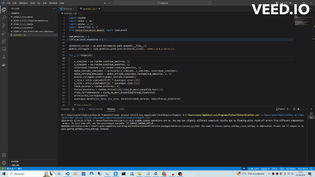

# 🖱️Artificial intelligence moving the mouse Randomly

📚This is an artificial intelligence for moving the mouse Randomly
main use case:more humanized automations
# 📚Wide variety of models
- AIMM_V0_0_1 (Available for download and use)
- AIMM_V0_0_1_fine_tuned (Available for download and use)
- AIMM_V_0_0_2 (Available for download and use)
- AIMM_V_0_0_3 (Available for download and use)
- AIMM_V_0_0_4 (Available for download and use)
- AIMM_V_0_0_5 (in training) 
## Índice

- [AIMM_V0_0_1](#AIMM_V0_0_1)
- [AIMM_V0_0_1_fine_tuned_with_new_data](#AIMM_V0_0_1_fine_tuned_with_new_data)
- [AIMM_V0_0_2](#AIMM_V0_0_2)
- [AIMM_V_0_0_3](#AIMM_V_0_0_3)
- [AIMM_V_0_0_4](#AIMM_V_0_0_4)
- [AIMM_V_0_0_5](#AIMM_V_0_0_5)
#
- [List-of-moves-for-AI](#List-of-moves-for-AI)


## 📚Example of V-0.0.4



## Code Example
------------------Average usage of model v1 with pyautogui for motion only-------------------------


 ```
  import pyautogui
  import os
  import time
  import random
  import numpy as np
  import pandas as pd
  import tensorflow as tf
  from tensorflow.keras.models import load_model
  
  num_amostras = 1  
  Lista_de_movi_expandida = {
      pyautogui.linear: "Linear",
      pyautogui.easeInQuad: "Ease In Quad",
      pyautogui.easeOutQuad: "Ease Out Quad",
      pyautogui.easeInOutQuad: "Ease In Out Quad",
      pyautogui.easeInCubic: "Ease In Cubic",
      pyautogui.easeOutCubic: "Ease Out Cubic",
      pyautogui.easeInOutCubic: "Ease In Out Cubic",
      pyautogui.easeInQuart: "Ease In Quart",
      pyautogui.easeOutQuart: "Ease Out Quart",
      pyautogui.easeInOutQuart: "Ease In Out Quart",
      pyautogui.easeInQuint: "Ease In Quint",
      pyautogui.easeOutQuint: "Ease Out Quint",
      pyautogui.easeInOutQuint: "Ease In Out Quint",
      pyautogui.easeInSine: "Ease In Sine",
      pyautogui.easeOutSine: "Ease Out Sine",
      pyautogui.easeInOutSine: "Ease In Out Sine",
      pyautogui.easeInExpo: "Ease In Expo",
      pyautogui.easeOutExpo: "Ease Out Expo",
      pyautogui.easeInOutExpo: "Ease In Out Expo",
      pyautogui.easeInCirc: "Ease In Circ",
      pyautogui.easeOutCirc: "Ease Out Circ",
      pyautogui.easeInOutCirc: "Ease In Out Circ",
      pyautogui.easeInElastic: "Ease In Elastic",
      pyautogui.easeOutElastic: "Ease Out Elastic",
      pyautogui.easeInOutElastic: "Ease In Out Elastic",
      pyautogui.easeInBack: "Ease In Back",
      pyautogui.easeOutBack: "Ease Out Back",
      pyautogui.easeInOutBack: "Ease In Out Back",
      pyautogui.easeInBounce: "Ease In Bounce",
      pyautogui.easeOutBounce: "Ease Out Bounce",
      pyautogui.easeInOutBounce: "Ease In Out Bounce"
  }
  
  diretorio_script = os.path.dirname(os.path.abspath(__file__))
  modelo_carregado = load_model(os.path.join(diretorio_script, 'AIMM_V_0_0_4.keras'))
  
  for _ in range(20):
          
      x_simulado = np.random.rand(num_amostras, 1) 
      y_simulado = np.random.rand(num_amostras, 1) 
      velocidade_simulada = np.random.rand(num_amostras, 1)  
      dados_entrada_simulados = np.hstack((x_simulado, y_simulado, velocidade_simulada))
      dados_entrada_simulados = dados_entrada_simulados.reshape(num_amostras, 1, 3)
      modelo_carregado.predict(dados_entrada_simulados)
      x_tela = int(x_simulado[0][0] * pyautogui.size()[0])
      y_tela = int(y_simulado[0][0] * pyautogui.size()[1])
      rando_duracao = random.uniform(3, 4)
      funcao_aleatoria = random.choice(list(Lista_de_movi_expandida.keys()))
      frase_correspondente = Lista_de_movi_expandida[funcao_aleatoria]
      print(frase_correspondente)
      pyautogui.moveTo(x=x_tela, y=y_tela, duration=rando_duracao, tween=funcao_aleatoria)
      
      #time.sleep(5)
 ```


## 📚Customize 
You can also customize pyautogui to move and click, be creative :}
# 📚Training new models
You can also train the model with greater movement variations

## 📚Resolution 
you can train a new model for the resolution you want

example 

        x = np.random.normal(loc=512, scale=300, size=n_movimentos).clip(0, 1280) # notice that we changed it to 1280 x 1024
        y = np.random.normal(loc=384, scale=200, size=n_movimentos).clip(0, 1024) # notice that we changed it to 1280 x 1024

notice that now the model will be trained to 1280 x 1024 resolution
#
## AIMM_V0_0_1 
 
Initial version contains 1,000,000 motion variations for 1024 x 768 resolution

 ```
  Model code
  AIMM_V_0_0_1/AIMM.py
 ```
 ```
  Model trained and ready to be used
  AIMM_V_0_0_1/AIMM_V1.keras
 ```
 Model code
 ```
        ## libs ###
        import numpy as np
        import pandas as pd
        from sklearn.model_selection import train_test_split
        from sklearn.preprocessing import MinMaxScaler
        import tensorflow as tf
        from tensorflow.keras.models import Sequential
        from tensorflow.keras.layers import LSTM, Dense, Dropout
        
        # defining how many cpu to use in training
        num_cores = 4
        tf.config.threading.set_intra_op_parallelism_threads(num_cores)
        tf.config.threading.set_inter_op_parallelism_threads(num_cores)
        
        # defining the desired number of mouse movement variations
        n_movimentos = 1000000
        
        # Resolution
        x = np.random.normal(loc=512, scale=300, size=n_movimentos).clip(0, 1024) # movements made for screens in 1024 x 768 resolution
        y = np.random.normal(loc=384, scale=200, size=n_movimentos).clip(0, 768) # movements made for screens in 1024 x 768 resolution
        
        velocidade = np.random.uniform(low=0.1, high=1.0, size=n_movimentos)
        cliques = np.random.choice([0, 1], size=n_movimentos, p=[0.7, 0.3])
        dados = pd.DataFrame({'x': x, 'y': y, 'velocidade': velocidade, 'clique': cliques})
        scaler = MinMaxScaler()
        dados_normalizados = pd.DataFrame(scaler.fit_transform(dados), columns=dados.columns)
        X = dados_normalizados.drop('clique', axis=1)
        y = dados_normalizados['clique']
        X_train, X_test, y_train, y_test = train_test_split(X, y, test_size=0.2, random_state=42)
        X_train = X_train.values.reshape((X_train.shape[0], 1, X_train.shape[1]))
        X_test = X_test.values.reshape((X_test.shape[0], 1, X_test.shape[1]))
        model = Sequential([
            LSTM(64, activation='relu', return_sequences=True, input_shape=(X_train.shape[1], X_train.shape[2])),
            Dropout(0.2),
            LSTM(32, activation='relu', return_sequences=True),  
            Dropout(0.2),
            LSTM(32, activation='relu', return_sequences=True),  
            Dropout(0.2),
            LSTM(16, activation='relu'),  
            Dropout(0.2),
            Dense(1, activation='sigmoid')
        ])
        model.compile(optimizer='adam', loss='binary_crossentropy', metrics=['accuracy'])
        history = model.fit(X_train, y_train, epochs=10, validation_data=(X_test, y_test), batch_size=64)
        model.save('AIMM_V1.keras')
  ```
#
# AIMM_V0_0_1_fine_tuned_with_new_data

 ```
  Model code
  AIMM_V_0_0_1/AIMM_V1_fine_tuned_with_new_data.py
 ```
 ```
  Model trained and ready to be used
  AIMM_V_0_0_1/AIMM_V1_fine_tuned_with_new_data.keras
 ```
 
 Model code
 ```
     import numpy as np
     import pandas as pd
     from sklearn.model_selection import train_test_split
     from sklearn.preprocessing import MinMaxScaler
     import tensorflow as tf
     from tensorflow.keras.models import load_model
     
     # Load the pre-trained model
     model = load_model('AIMM_V1.keras')
     
     # Define new resolutions and motion variations settings
     n_new_movements = 5000000
     resolucoes_x = np.random.normal(loc=512, scale=300, size=n_new_movements).clip(0, 1280)
     resolucoes_y = np.random.normal(loc=384, scale=200, size=n_new_movements).clip(0, 1024)
     new_velocities = np.random.uniform(low=0.1, high=1.0, size=n_new_movements)
     new_clicks = np.random.choice([0, 1], size=n_new_movements, p=[0.7, 0.3])
     
     # Create DataFrame with the new data
     new_data = pd.DataFrame({'x': resolucoes_x, 'y': resolucoes_y, 'velocidade': new_velocities, 'clique': new_clicks})
     
     # Create a new scaler and adjust it to the new data
     scaler = MinMaxScaler()
     scaler.fit(new_data[['x', 'y', 'speed']])
     
     # Normalize the new data
     new_normalized_data = pd.DataFrame(scaler.transform(new_data[['x', 'y', 'velocidade']]), columns=['x', 'y', 'velocidade'])
     new_normalized_data['click'] = new_data['click']
     
     X_novos = new_normalized_data.drop('click', axis=1)
     y_novos = new_normalized_data['click']
     # Add a new dimension to the input data
     X_novos_expanded = np.expand_dims(X_novos, axis=1)
     
     # Train the model with the new data
     history = model.fit(X_novos_expanded, y_novos, epochs=5, validation_split=0.2, batch_size=64)
     
     # Save the fine-tuned model with the new data
     model.save('AIMM_V1_fine_tuned_with_new_data.keras')
 ```
#
# AIMM_V0_0_2
```
  Trained Model Location
  AIMM_V_0_0_2/AIMM_V_0_0_2.keras
```
```
  Code location
  AIMM_V_0_0_2/AIMM_V_0_0_2.py
```
Model code
```
    ### Artificial intelligence for moving the mouse ###
    import numpy as np
    import pandas as pd
    from sklearn.model_selection import train_test_split
    from sklearn.preprocessing import MinMaxScaler
    import tensorflow as tf
    from tensorflow.keras.models import Sequential
    from tensorflow.keras.layers import LSTM, Dense, Dropout
    num_cores = 4
    tf.config.threading.set_intra_op_parallelism_threads(num_cores)
    tf.config.threading.set_inter_op_parallelism_threads(num_cores)
    n_movimentos = 10000000
    x = np.random.normal(loc=512, scale=300, size=n_movimentos).clip(0, 1280)
    y = np.random.normal(loc=384, scale=200, size=n_movimentos).clip(0, 1024)
    velocidade = np.random.uniform(low=0.1, high=1.0, size=n_movimentos)
    cliques = np.random.choice([0, 1], size=n_movimentos, p=[0.7, 0.3])
    dados = pd.DataFrame({'x': x, 'y': y, 'velocidade': velocidade, 'clique': cliques})
    scaler = MinMaxScaler()
    dados_normalizados = pd.DataFrame(scaler.fit_transform(dados), columns=dados.columns)
    X = dados_normalizados.drop('clique', axis=1)
    y = dados_normalizados['clique']
    X_train, X_test, y_train, y_test = train_test_split(X, y, test_size=0.2, random_state=42)
    X_train = X_train.values.reshape((X_train.shape[0], 1, X_train.shape[1]))
    X_test = X_test.values.reshape((X_test.shape[0], 1, X_test.shape[1]))
    model = Sequential([
        LSTM(64, activation='relu', return_sequences=True, input_shape=(X_train.shape[1], X_train.shape[2])),
        Dropout(0.2),
        LSTM(32, activation='relu', return_sequences=True),  
        Dropout(0.2),
        LSTM(32, activation='relu', return_sequences=True),  
        Dropout(0.2),
        LSTM(32, activation='relu', return_sequences=True),  
        Dropout(0.2),
        LSTM(16, activation='relu'),  
        Dropout(0.2),
        Dense(1, activation='sigmoid')
    ])
    model.compile(optimizer='adam', loss='binary_crossentropy', metrics=['accuracy'])
    history = model.fit(X_train, y_train, epochs=10, validation_data=(X_test, y_test), batch_size=64)
    model.save('AIMM_V_0_0_2.keras')
```
#
# AIMM_V_0_0_3
```
  Trained Model Location
  AIMM_V_0_0_3/AIMM_V_0_0_3.keras
```
```
  Code location
  AIMM_V_0_0_3/AIMM_V_0_0_3.py
```
Model code
```
 import numpy as np
 import pandas as pd
 from sklearn.model_selection import train_test_split
 from sklearn.preprocessing import MinMaxScaler
 import tensorflow as tf
 from tensorflow.keras.models import load_model
 from tensorflow.keras.layers import LSTM, Dense, Dropout
 
 model = load_model('AIMM_V_0_0_2.keras')
 
 n_new_movements = 1000000
 resolucoes_x = np.random.normal(loc=512, scale=300, size=n_new_movements).clip(0, 1152)
 resolucoes_y = np.random.normal(loc=384, scale=200, size=n_new_movements).clip(0, 864)
 new_velocities = np.random.uniform(low=0.1, high=1.0, size=n_new_movements)
 new_clicks = np.random.choice([0, 1], size=n_new_movements, p=[0.7, 0.3])
 
 # Create DataFrame with the new data
 new_data = pd.DataFrame({'x': resolucoes_x, 'y': resolucoes_y, 'velocidade': new_velocities, 'click': new_clicks})
 
 # Create a new scaler and adjust it to the new data
 scaler = MinMaxScaler()
 scaler.fit(new_data[['x', 'y', 'velocidade']])
 
 # Normalize the new data
 new_normalized_data = pd.DataFrame(scaler.transform(new_data[['x', 'y', 'velocidade']]), columns=['x', 'y', 'velocidade'])
 new_normalized_data['click'] = new_data['click']
 
 X_novos = new_normalized_data.drop('click', axis=1)
 y_novos = new_normalized_data['click']
 # Add a new dimension to the input data
 X_novos_expanded = np.expand_dims(X_novos, axis=1)
 
 # Train the model with the new data
 history = model.fit(X_novos_expanded, y_novos, epochs=5, validation_split=0.2, batch_size=64)
 
 # Salvar o modelo fine-tuned com os novos dados
 model.save('AIMM_V_0_0_3.keras')
```
#
# AIMM_V_0_0_4
```
  Trained Model Location
  AIMM_V_0_0_4/AIMM_V_0_0_4.keras
```
```
  Code location
  AIMM_V_0_0_4/AIMM_V_0_0_4.py
```
Model code
```
 import numpy as np
 import pandas as pd
 from sklearn.preprocessing import MinMaxScaler
 import tensorflow as tf
 from tensorflow.keras.models import load_model
 from tensorflow.keras.layers import LSTM, Dense, Dropout
 from tensorflow.keras import regularizers
 
 # Carregar o modelo pré-treinado
 model = load_model('AIMM_V_0_0_3.keras')
 
 # Definir o número total de movimentos
 n_new_movements = 1000000
 
 # Definir o tamanho do lote
 batch_size = 100000
 
 # Definir o número de lotes
 num_batches = n_new_movements // batch_size
 
 # Criar um DataFrame vazio para armazenar os dados
 all_data = pd.DataFrame()
 
 # Loop sobre os lotes
 for i in range(num_batches):
     print(f'Processando lote {i+1}/{num_batches}')
     
     # Gerar dados para o lote atual
     resolucoes_x = np.random.normal(loc=512, scale=300, size=batch_size).clip(0, 1280)
     resolucoes_y = np.random.normal(loc=384, scale=200, size=batch_size).clip(0, 720)
     new_velocities = np.random.uniform(low=0.1, high=1.0, size=batch_size)
     new_clicks = np.random.choice([0, 1], size=batch_size, p=[0.7, 0.3])
     
     # Criar DataFrame com os dados do lote atual
     batch_data = pd.DataFrame({'x': resolucoes_x, 'y': resolucoes_y, 'velocidade': new_velocities, 'click': new_clicks})
     
     # Adicionar dados do lote atual ao DataFrame geral
     all_data = pd.concat([all_data, batch_data], ignore_index=True)
 
 # Create a new scaler and adjust it to the new data
 scaler = MinMaxScaler()
 scaler.fit(all_data[['x', 'y', 'velocidade']])
 
 # Normalize the new data
 new_normalized_data = pd.DataFrame(scaler.transform(all_data[['x', 'y', 'velocidade']]), columns=['x', 'y', 'velocidade'])
 new_normalized_data['click'] = all_data['click']
 
 X_novos = new_normalized_data.drop('click', axis=1)
 y_novos = new_normalized_data['click']
 
 # Add a new dimension to the input data
 X_novos_expanded = np.expand_dims(X_novos, axis=1)
 
 # Criar um novo modelo
 new_model = tf.keras.Sequential([
     LSTM(64, activation='relu', return_sequences=True, input_shape=(X_novos_expanded.shape[1], X_novos_expanded.shape[2])),
     Dropout(0.2),
     LSTM(32, activation='relu', return_sequences=True),  
     Dropout(0.2),
     LSTM(32, activation='relu', return_sequences=True),  
     Dropout(0.2),
     LSTM(32, activation='relu', return_sequences=True),  
     Dropout(0.2),
     LSTM(16, activation='relu'),  
     Dropout(0.2),
     Dense(1, activation='sigmoid'),
     Dense(64, activation='relu', kernel_regularizer=regularizers.l2(0.01)),
     Dropout(0.2),
     Dense(32, activation='relu', kernel_regularizer=regularizers.l2(0.01)),
     Dropout(0.2)
 ])
 
 # Compilar o novo modelo com uma taxa de aprendizado menor
 optimizer = tf.keras.optimizers.Adam(learning_rate=0.001)
 new_model.compile(optimizer=optimizer, loss='binary_crossentropy', metrics=['accuracy'])
 
 # Treinar o novo modelo com os novos dados
 history = new_model.fit(X_novos_expanded, y_novos, epochs=10, validation_split=0.5, batch_size=64)
 
 # Salvar o modelo fine-tuned com os novos dados
 new_model.save('AIMM_V_0_0_4.keras')

```
#
# AIMM_V_0_0_5 (in training) 
 # 60 million motion for resolutions 1152x864 1280x1024 1280x720 1280x768
```

```
#
# List of moves for AI
```
  List of moves for AI/List_of_moves_for_AI.py
```
```
import random
import pyautogui

class movimento_com_pyautogui:
    def movimentos_do_mouse_pra_IA():
        Lista_de_movi_expandida = {
            pyautogui.linear: "Linear",
            pyautogui.easeInQuad: "Ease In Quad",
            pyautogui.easeOutQuad: "Ease Out Quad",
            pyautogui.easeInOutQuad: "Ease In Out Quad",
            pyautogui.easeInCubic: "Ease In Cubic",
            pyautogui.easeOutCubic: "Ease Out Cubic",
            pyautogui.easeInOutCubic: "Ease In Out Cubic",
            pyautogui.easeInQuart: "Ease In Quart",
            pyautogui.easeOutQuart: "Ease Out Quart",
            pyautogui.easeInOutQuart: "Ease In Out Quart",
            pyautogui.easeInQuint: "Ease In Quint",
            pyautogui.easeOutQuint: "Ease Out Quint",
            pyautogui.easeInOutQuint: "Ease In Out Quint",
            pyautogui.easeInSine: "Ease In Sine",
            pyautogui.easeOutSine: "Ease Out Sine",
            pyautogui.easeInOutSine: "Ease In Out Sine",
            pyautogui.easeInExpo: "Ease In Expo",
            pyautogui.easeOutExpo: "Ease Out Expo",
            pyautogui.easeInOutExpo: "Ease In Out Expo",
            pyautogui.easeInCirc: "Ease In Circ",
            pyautogui.easeOutCirc: "Ease Out Circ",
            pyautogui.easeInOutCirc: "Ease In Out Circ",
            pyautogui.easeInElastic: "Ease In Elastic",
            pyautogui.easeOutElastic: "Ease Out Elastic",
            pyautogui.easeInOutElastic: "Ease In Out Elastic",
            pyautogui.easeInBack: "Ease In Back",
            pyautogui.easeOutBack: "Ease Out Back",
            pyautogui.easeInOutBack: "Ease In Out Back",
            pyautogui.easeInBounce: "Ease In Bounce",
            pyautogui.easeOutBounce: "Ease Out Bounce",
            pyautogui.easeInOutBounce: "Ease In Out Bounce"
        }
        funcao_aleatoria = random.choice(list(Lista_de_movi_expandida.keys()))
        frase_correspondente = Lista_de_movi_expandida[funcao_aleatoria]
        return funcao_aleatoria, frase_correspondente
```


  
#
#
### 📚Pool request
any pool request is welcome :}
  
### 📚Powerful model
If you create a super powerful model with 100,000,000,000 variations and a giant neural network, don't hesitate to share :} 👋


                
